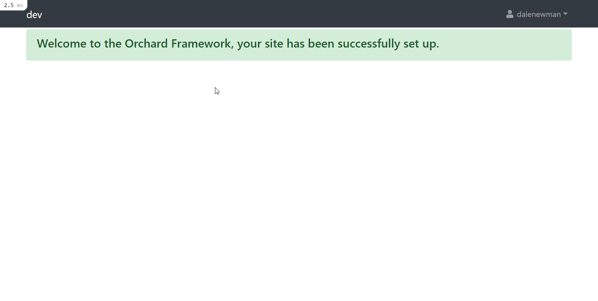

A [Transformalize](https://github.com/dalenewman/Transformalize) 
module for [Orchard Core](https://github.com/OrchardCMS/OrchardCore) rc2. 

#### Features
- <strike>Code Mirror XML Editor for arrangements</strike>
- Reporting
   - <strike>Sortable, Filterable Table with pagination</strike>
   - <strike>CSV Extract</strike>
   - <strike>JSON Extract</strike>
   - Map(Box) view
   - Calendar view
- <strike>Batches / Bulk Actions</strike>
  - <strike>Tasks (ETL Jobs) for running batches, etc</strike>
  - <strike>Forms for accepting parameters for batches</strike>
- <strike>Add Mini Profiler into ADO providers</strike>
- <strike>Common Arrangement Settings</strike>
  - <strike>Parameters</strike>
  - <strike>Connections</strike>
  - <strike>Actions</strike>
  - <strike>Page Sizes</strike>

#### Providers
- <strike>[Elasticsearch](https://github.com/dalenewman/Transformalize.Provider.Elasticsearch)</strike>, <strike>[SQL Server](https://github.com/dalenewman/Transformalize.Provider.SqlServer)</strike>, <strike>[PostgreSQL](https://github.com/dalenewman/Transformalize.Provider.PostgreSql)</strike>, <strike>[SQLite](https://github.com/dalenewman/Transformalize.Provider.SQLite)</strike>, <strike>[MySql](https://github.com/dalenewman/Transformalize.Provider.MySql)</strike>, <strike>[JSON](https://github.com/dalenewman/Transformalize.Provider.JSON)</strike>, <strike>[CSV](https://github.com/dalenewman/Transformalize.Provider.CsvHelper)</strike>, <strike>[Bogus](https://github.com/dalenewman/Transformalize.Provider.Bogus)</strike>, <strike>[GeoJson](https://github.com/dalenewman/Transformalize.Provider.GeoJson)</strike>
- [SOLR](https://github.com/dalenewman/Transformalize.Provider.SOLR), [KML](https://github.com/dalenewman/Transformalize/tree/master/Providers/Kml), [Lucene](https://github.com/dalenewman/Transformalize.Provider.Lucene)

#### Transforms
- <strike>built-in [transforms](https://github.com/dalenewman/Transformalize/blob/master/Containers/Autofac/Transformalize.Container.Autofac.Shared/TransformBuilder.cs) and [validators](https://github.com/dalenewman/Transformalize/blob/master/Containers/Autofac/Transformalize.Container.Autofac.Shared/ValidateBuilder.cs)</strike>, <strike>[Jint](https://github.com/dalenewman/Transformalize.Transform.Jint
)</strike>, <strike>JSON</strike>, <strike>[Humanize](https://github.com/dalenewman/Transformalize.Transform.Humanizer)</strike>
- [Razor](https://github.com/dalenewman/Transformalize.Provider.Razor), [Liquid / Fluid](https://github.com/dalenewman/Transformalize.Transform.Fluid
), [Lambda Parser](https://github.com/dalenewman/Transformalize.Transform.LambdaParser)
- Orchard transforms: <strike>username()</strike>, <strike>userid()</strike>, <strike>useremail()</strike>.
- <strike>file related (get file name, file path, file extension)</strike>

#### Actions
- <strike>file related (copy, move, archive, replace)</strike>
- <strike>nested tasks</strike>
- <strike>log</strike>

#### Development Environment
- Visual Studio 2019 with ASP.NET Core related workloads:
  - ASP.NET and Web Development
  - .NET Core Cross-Platform Development
- Add nuget package source https://www.myget.org/F/transformalize/api/v3/index.json
- Set the Site as the startup project and run.
- Enable Transformalize in Dashboard > Configuration > Features
- Optionally run Transformalize recipes in Dashboard > Configuration > Recipes

#### Module Dependencies
You may have to enable some of these manually.
- `OrchardCore.Users`
- `OrchardCore.Contents`
- `OrchardCore.Title`
- [`Etch.OrchardCore.ContentPermissions`](https://github.com/EtchUK/Etch.OrchardCore.ContentPermissions)
- `OrchardCore.MiniProfiler`
- `OrchardCore.Alias`
- `OrchardCore.ContentFields`

---

#### Reporting
Using [Transformalize](https://github.com/dalenewman/Transformalize) for reporting basically means you 
read from one entity and do not specify an output.  The [bogus](https://github.com/dalenewman/Transformalize.Provider.Bogus) provider 
(see below) is fun to play with if you don't have any data sources.  To find out 
more about the providers, click on the links above.  Also, be sure to read 
the main [Transformalize](https://github.com/dalenewman/Transformalize) read me page.



#### Tasks
Tasks can transform, validate, or de-normalize data (as seen in the [Transformalize](https://github.com/dalenewman/Transformalize) read me).
They can also run actions or other tasks.  You can use them to write and run SQL scripts 
or manipulate every row (e.g. with an ADO run transform).

#### Bulk Actions
When you enable Bulk Actions on a report, you designate a field or calculated field 
in your arrangement as the Bulk Action Value Field.  Each row's value from 
this field is sent to the bulk action.

Bulk actions you run correspond to previously defined tasks.  Tasks are added to 
an arrangement like this:

```xml
<cfg name="report">
   <actions>
      <add name="the-alias-of-your-task" description="seen in the bulk action dropdown" />
   </actions>
   <connections/>
   <entities/>
</cfg>
```

In order for bulk actions to work in a flexible way, 6 tasks must be 
defined:

1. `batch-create`: creates and returns a batch id
2. `batch-write`: writes batch id and bulk action's values.
3. `batch-summary`: Returns a batch summary for Review and Result page.
4. `batch-success`: runs on success
5. `batch-fail`: runs on failure
6. `batch-running`: runs when bulk action is sent to background or queue

A recipe named "Transformalize Batches SQLite" provides a SQLite 
example.  These task names (aliases) are hard-coded 
right now but will be put into settings.

